# 从头实现 Llama3 模型
在这个文件中，我从头实现了 Llama3，其中包含张量和矩阵乘法。
<br>
此外，我将直接从 Meta 提供的 Llama3 模型文件中加载张量，在运行此文件之前，您需要下载权重。
这是官方链接： https://llama.meta.com/llama-downloads/

<div>
    
</div>

## 分词器

我不会实现一个 BPE 分词器（但 Andrej Karpathy 也有一个非常简洁的实现）
<br>
这是他的项目地址： https://github.com/karpathy/minbpe


<div>
    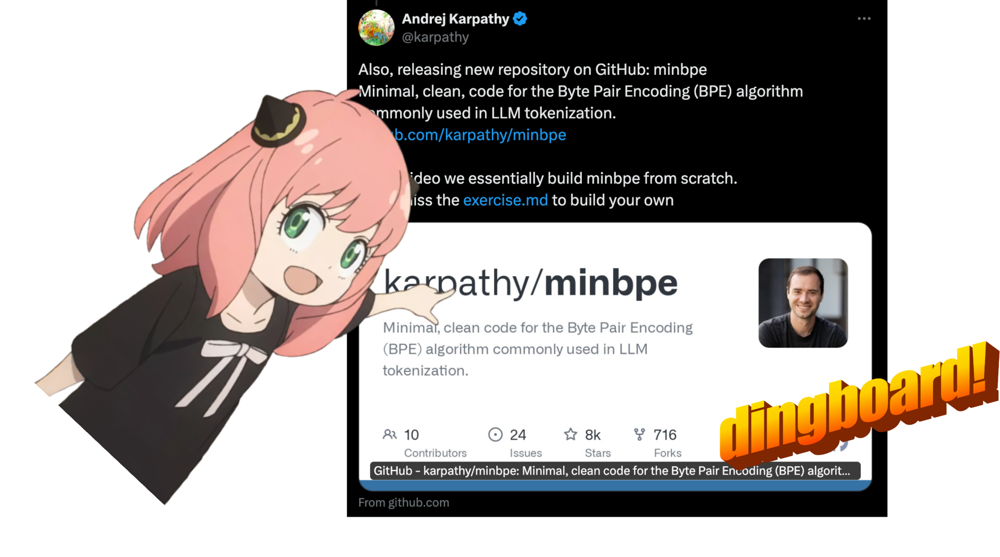
</div>


```python
from pathlib import Path
import tiktoken
from tiktoken.load import load_tiktoken_bpe
import torch
import json
import matplotlib.pyplot as plt

# 加载分词器模型路径
tokenizer_path = "Meta-Llama-3-8B/tokenizer.model"
special_tokens = [
            "<|begin_of_text|>",
            "<|end_of_text|>",
            "<|reserved_special_token_0|>",
            "<|reserved_special_token_1|>",
            "<|reserved_special_token_2|>",
            "<|reserved_special_token_3|>",
            "<|start_header_id|>",
            "<|end_header_id|>",
            "<|reserved_special_token_4|>",
            "<|eot_id|>",  # end of turn
        ] + [f"<|reserved_special_token_{i}|>" for i in range(5, 256 - 5)]
mergeable_ranks = load_tiktoken_bpe(tokenizer_path)
tokenizer = tiktoken.Encoding(
    name=Path(tokenizer_path).name,
    pat_str=r"(?i:'s|'t|'re|'ve|'m|'ll|'d)|[^\r\n\p{L}\p{N}]?\p{L}+|\p{N}{1,3}| ?[^\s\p{L}\p{N}]+[\r\n]*|\s*[\r\n]+|\s+(?!\S)|\s+",
    mergeable_ranks=mergeable_ranks,
    special_tokens={token: len(mergeable_ranks) + i for i, token in enumerate(special_tokens)},
)

# 测试分词器编码和解码功能
tokenizer.decode(tokenizer.encode("hello world!"))
```


    'hello world!'


## 读取模型文件
通常，读取模型文件,往往取决于模型类的编写方式以及其中的变量名。
<br>
但由于我们要从头实现 Llama3，我们将一次性读取一个张量。
<div>
    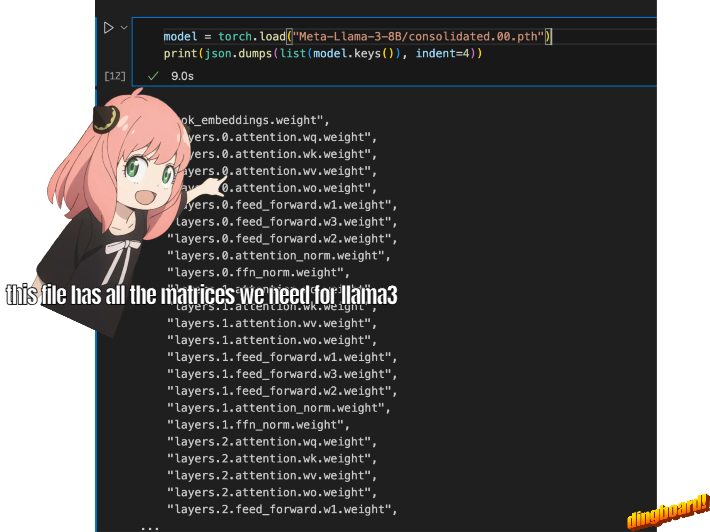
</div>


```python
# 加载模型权重
model = torch.load("Meta-Llama-3-8B/consolidated.00.pth")
print(json.dumps(list(model.keys())[:20], indent=4))
```

    [
        "tok_embeddings.weight",
        "layers.0.attention.wq.weight",
        "layers.0.attention.wk.weight",
        "layers.0.attention.wv.weight",
        "layers.0.attention.wo.weight",
        "layers.0.feed_forward.w1.weight",
        "layers.0.feed_forward.w3.weight",
        "layers.0.feed_forward.w2.weight",
        "layers.0.attention_norm.weight",
        "layers.0.ffn_norm.weight",
        "layers.1.attention.wq.weight",
        "layers.1.attention.wk.weight",
        "layers.1.attention.wv.weight",
        "layers.1.attention.wo.weight",
        "layers.1.feed_forward.w1.weight",
        "layers.1.feed_forward.w3.weight",
        "layers.1.feed_forward.w2.weight",
        "layers.1.attention_norm.weight",
        "layers.1.ffn_norm.weight",
        "layers.2.attention.wq.weight"
    ]


```python

# 获取模型配置参数
with open("Meta-Llama-3-8B/params.json", "r") as f:
    config = json.load(f)
config
```


    {'dim': 4096,
     'n_layers': 32,
     'n_heads': 32,
     'n_kv_heads': 8,
     'vocab_size': 128256,
     'multiple_of': 1024,
     'ffn_dim_multiplier': 1.3,
     'norm_eps': 1e-05,
     'rope_theta': 500000.0}


## 使用这些配置推断模型的细节
1. 模型有 32 个 Transformer 层
2. 每个多头注意力块有 32 个头
3. 词汇表大小等


```python
# 从配置文件中提取模型参数
dim = config["dim"]
n_layers = config["n_layers"]
n_heads = config["n_heads"]
n_kv_heads = config["n_kv_heads"]
vocab_size = config["vocab_size"]
multiple_of = config["multiple_of"]
ffn_dim_multiplier = config["ffn_dim_multiplier"]
norm_eps = config["norm_eps"]
rope_theta = torch.tensor(config["rope_theta"])
```

## 将文本转换为 token
这里我们使用 tiktoken（我觉得应该是 OpenAI 的库）作为分词器
<div>
    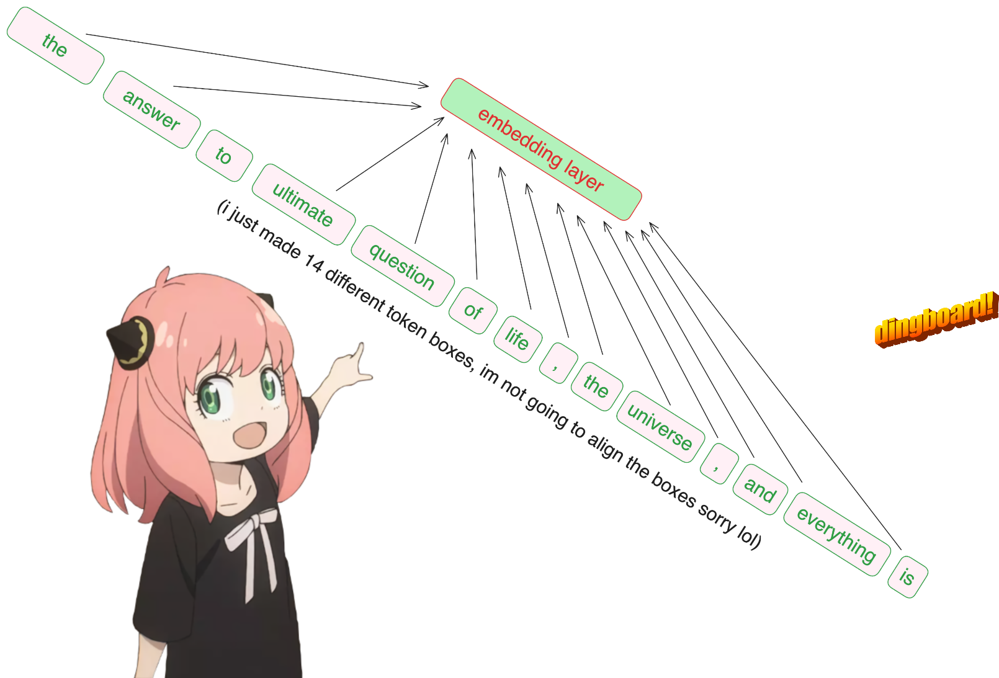
</div>


```python
prompt = "the answer to the ultimate question of life, the universe, and everything is "

# 编码为token
tokens = [128000] + tokenizer.encode(prompt)
print(tokens)
tokens = torch.tensor(tokens)

# 将每个 token 解码为对应的文本
prompt_split_as_tokens = [tokenizer.decode([token.item()]) for token in tokens]
print(prompt_split_as_tokens)
```

    [128000, 1820, 4320, 311, 279, 17139, 3488, 315, 2324, 11, 279, 15861, 11, 323, 4395, 374, 220]
    ['<|begin_of_text|>', 'the', ' answer', ' to', ' the', ' ultimate', ' question', ' of', ' life', ',', ' the', ' universe', ',', ' and', ' everything', ' is', ' ']


## 将 token 转换为其对应的 embedding

这里我们使用内置的神经网络模块
<br>
反正, 我们的 [17x1] token 现在是 [17x4096]，即每个 token 的长度为 4096 的 embeddings
<br>
<br>
注意：跟踪 shapes，这样一切将变得理解更容易

<div>
    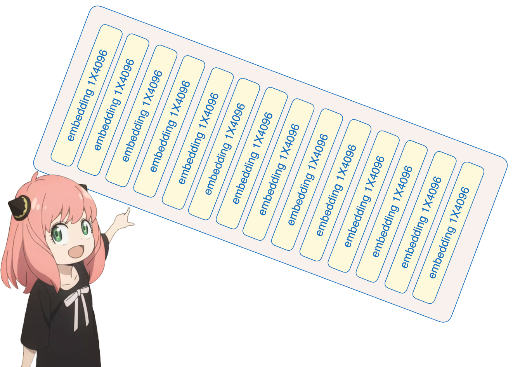
</div>


```python

# 加载嵌入层并复制权重
embedding_layer = torch.nn.Embedding(vocab_size, dim)
embedding_layer.weight.data.copy_(model["tok_embeddings.weight"])

# 获取未归一化的 token 嵌入
token_embeddings_unnormalized = embedding_layer(tokens).to(torch.bfloat16)
token_embeddings_unnormalized.shape
```


    torch.Size([17, 4096])


## 接下来我们使用 rms 归一化嵌入
请注意，经过此步骤后 shapes 不变，只是值被归一化

<br>
需要注意的是，我们需要一个 norm_eps（来自配置）以避免不小心将 rms 设置为 0 并导致除以 0 的情况

<br>
这是公式:
<div>
    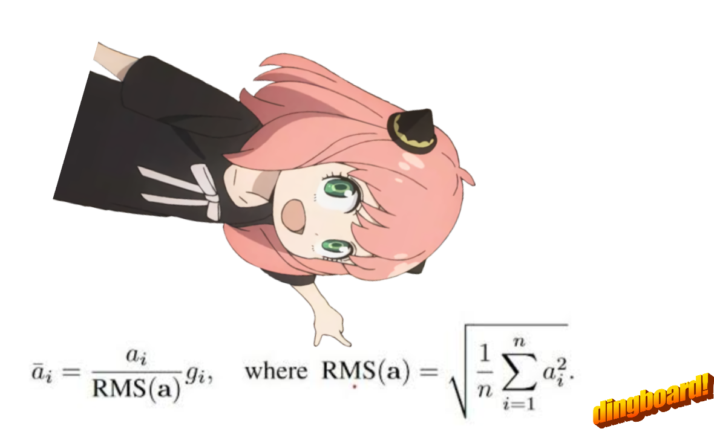
</div>


```python
# rms 归一化函数

# def rms_norm(tensor, norm_weights):
#     rms = (tensor.pow(2).mean(-1, keepdim=True) + norm_eps)**0.5
#     return tensor * (norm_weights / rms)
def rms_norm(tensor, norm_weights):
    return (tensor * torch.rsqrt(tensor.pow(2).mean(-1, keepdim=True) + norm_eps)) * norm_weights
```

# 构建第一个 Transformer 层


### 归一化

我们从模型字典中访问 layer.0（这是第一层）
<br>
归一化后 shapes 仍然是 [17x4096]，与嵌入相同但已归一化

<div>
    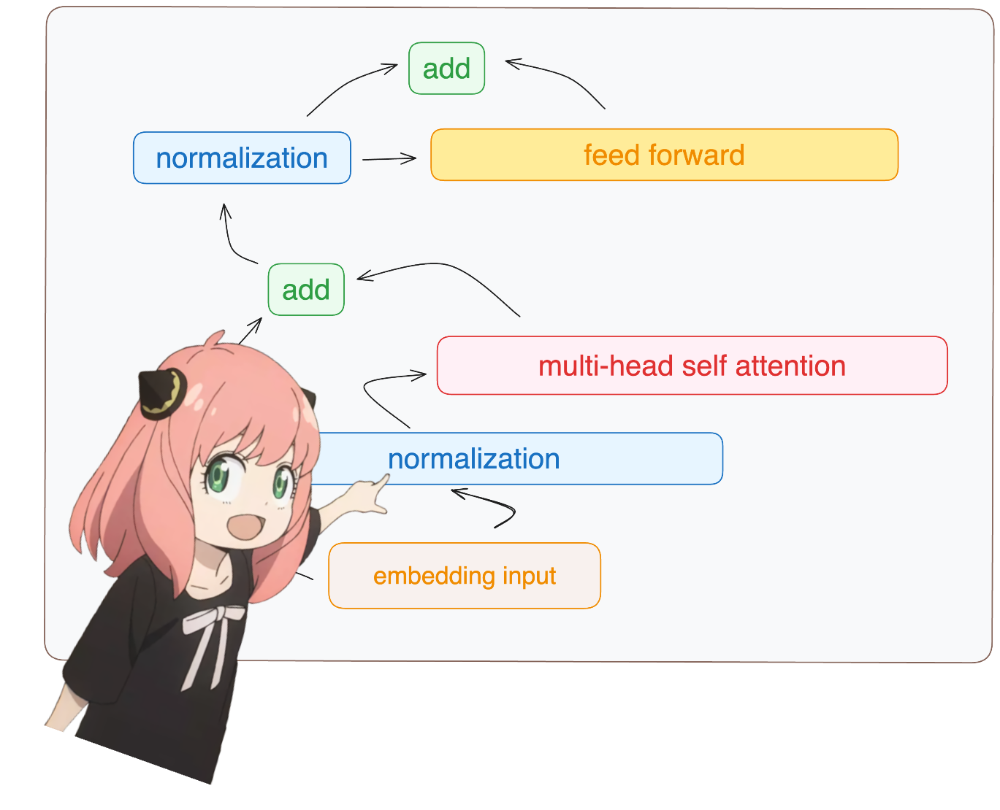
</div>


```python
# 归一化token嵌入
token_embeddings = rms_norm(token_embeddings_unnormalized, model["layers.0.attention_norm.weight"])
token_embeddings.shape
```


    torch.Size([17, 4096])


### 从头实现注意力机制

让我们加载第一个 Transformer 层的注意力头

<div>
    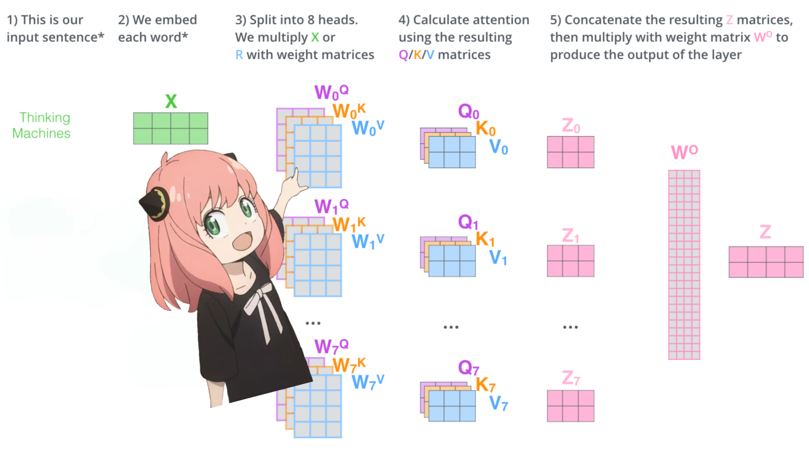
</div>

<br>

&gt; 当我们从模型中加载 query，key，value 和 output 向量时，我们注意到 shapes 分别为 [4096x4096]，[1024x4096]，[1024x4096]，[4096x4096]
<br>
&gt; 乍一看这有些奇怪，因为在理想情况下我们希望每个头单独拥有各自的 q，k，v 和 o
<br>
&gt; 这里作者将其捆绑在一起，为什么会这样呢? 因为这样有助于并行化注意力头的计算
<br>
&gt; 我将展开所有内容...


```python
# 打印第一个层的注意力权重 shapes
print(
    model["layers.0.attention.wq.weight"].shape,
    model["layers.0.attention.wk.weight"].shape,
    model["layers.0.attention.wv.weight"].shape,
    model["layers.0.attention.wo.weight"].shape
)
```

    torch.Size([4096, 4096]) torch.Size([1024, 4096]) torch.Size([1024, 4096]) torch.Size([4096, 4096])


### 展开 query
在下一节中，我们将展开多个注意力头的 query，得到的 shapes 为 [32x128x4096]
<br><br>
这里的 32 是 Llama3 的注意力头数量，128 是 query 向量的大小，4096 是 token 嵌入的大小

```python
# 重塑 query 权重为[头数，头维度，嵌入维度]

q_layer0 = model["layers.0.attention.wq.weight"]
head_dim = q_layer0.shape[0] // n_heads
q_layer0 = q_layer0.view(n_heads, head_dim, dim)
q_layer0.shape
```


    torch.Size([32, 128, 4096])


### 实现第一层的第一个头
这里我查询了第一个层的第一个头的 query 权重矩阵，其大小为 [128x4096]


```python
q_layer0_head0 = q_layer0[0]
q_layer0_head0.shape
```


    torch.Size([128, 4096])


### 我们现在将 query 权重与 token 嵌入相乘，以获得每个 token 的 query

这里你可以看到得到的 shape 是 [17x128]，这是因为我们有 17 个 token，每个 token 有一个长度为 128 的 query

<div>
    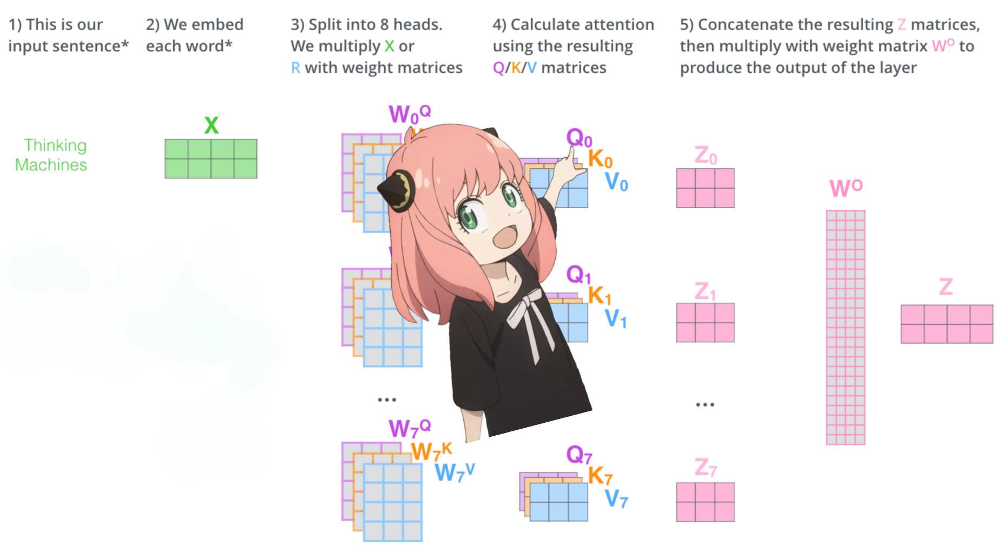
</div>


```python
q_per_token = torch.matmul(token_embeddings, q_layer0_head0.T)
q_per_token.shape
```


    torch.Size([17, 128])


## 位置编码
当前，每个 token 都有一个 query 向量，但如果你想一想 -- 其实各个 query 向量并不知道它们在 prompt 中的位置。
<br><br>
query: "the answer to the ultimate question of life, the universe, and everything is "
<br><br>
在我们的示例 promp t中，我们使用了三次 "the"，我们需要根据它们在 prompt 中的位置为每个 "the" token 生成不同的 query 向量（每个长度为128）。我们可以使用 RoPE（旋转位置编码）来实现这一点。
<br><br>

### RoPE
来看看这个视频(我就是看的这个)可以理解其中的数据学逻辑。
https://www.youtube.com/watch?v=o29P0Kpobz0&t=530s


<div>
    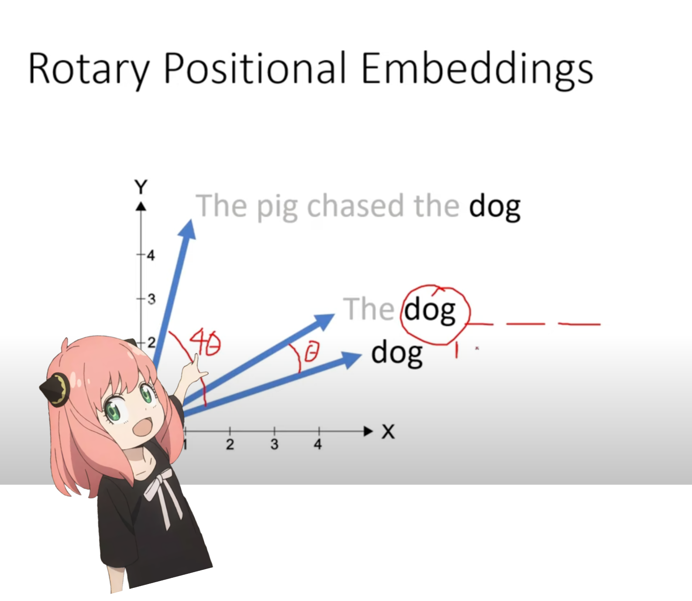
</div>


```python
q_per_token_split_into_pairs = q_per_token.float().view(q_per_token.shape[0], -1, 2)
q_per_token_split_into_pairs.shape
```


    torch.Size([17, 64, 2])


这里我们为 prompt 中每个位置生成了旋转位置编码。可以看到，这些编码是正弦和余弦函数的组合。

在上的步骤里, 我们将 query 向量分成对, 并对每对应用旋转角度移位!
<br><br>
我们现在有一个大小为 [17x64x2] 的向量，这是针对 prompt 中的每个 token 将 128 个长度的 query 分为 64 对！ 这 64 对中的每一对都将旋转 m*(theta)，其中 m 是我们旋转查询的标记的位置！


<div>
    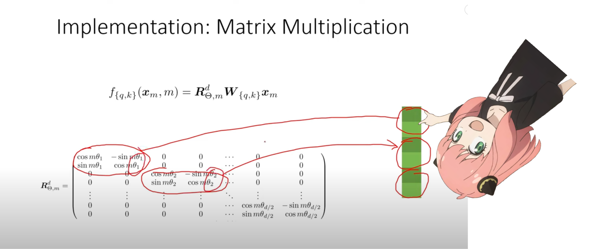
</div>

## using dot product of complex numbers to rotate a vector
<div>
    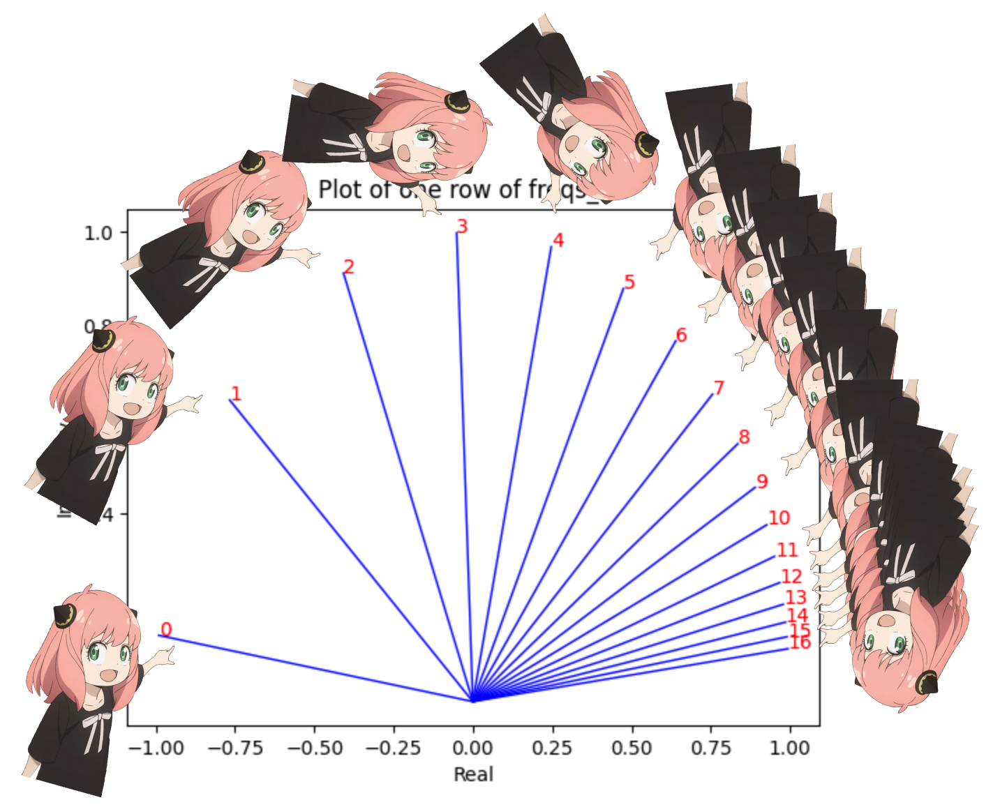
</div>


```python
zero_to_one_split_into_64_parts = torch.tensor(range(64))/64
zero_to_one_split_into_64_parts
```


    tensor([0.0000, 0.0156, 0.0312, 0.0469, 0.0625, 0.0781, 0.0938, 0.1094, 0.1250,
            0.1406, 0.1562, 0.1719, 0.1875, 0.2031, 0.2188, 0.2344, 0.2500, 0.2656,
            0.2812, 0.2969, 0.3125, 0.3281, 0.3438, 0.3594, 0.3750, 0.3906, 0.4062,
            0.4219, 0.4375, 0.4531, 0.4688, 0.4844, 0.5000, 0.5156, 0.5312, 0.5469,
            0.5625, 0.5781, 0.5938, 0.6094, 0.6250, 0.6406, 0.6562, 0.6719, 0.6875,
            0.7031, 0.7188, 0.7344, 0.7500, 0.7656, 0.7812, 0.7969, 0.8125, 0.8281,
            0.8438, 0.8594, 0.8750, 0.8906, 0.9062, 0.9219, 0.9375, 0.9531, 0.9688,
            0.9844])


```python
freqs = 1.0 / (rope_theta ** zero_to_one_split_into_64_parts)
freqs
```


    tensor([1.0000e+00, 8.1462e-01, 6.6360e-01, 5.4058e-01, 4.4037e-01, 3.5873e-01,
            2.9223e-01, 2.3805e-01, 1.9392e-01, 1.5797e-01, 1.2869e-01, 1.0483e-01,
            8.5397e-02, 6.9566e-02, 5.6670e-02, 4.6164e-02, 3.7606e-02, 3.0635e-02,
            2.4955e-02, 2.0329e-02, 1.6560e-02, 1.3490e-02, 1.0990e-02, 8.9523e-03,
            7.2927e-03, 5.9407e-03, 4.8394e-03, 3.9423e-03, 3.2114e-03, 2.6161e-03,
            2.1311e-03, 1.7360e-03, 1.4142e-03, 1.1520e-03, 9.3847e-04, 7.6450e-04,
            6.2277e-04, 5.0732e-04, 4.1327e-04, 3.3666e-04, 2.7425e-04, 2.2341e-04,
            1.8199e-04, 1.4825e-04, 1.2077e-04, 9.8381e-05, 8.0143e-05, 6.5286e-05,
            5.3183e-05, 4.3324e-05, 3.5292e-05, 2.8750e-05, 2.3420e-05, 1.9078e-05,
            1.5542e-05, 1.2660e-05, 1.0313e-05, 8.4015e-06, 6.8440e-06, 5.5752e-06,
            4.5417e-06, 3.6997e-06, 3.0139e-06, 2.4551e-06])


```python
freqs_for_each_token = torch.outer(torch.arange(17), freqs)
freqs_cis = torch.polar(torch.ones_like(freqs_for_each_token), freqs_for_each_token)
freqs_cis.shape

# viewing tjhe third row of freqs_cis
value = freqs_cis[3]
plt.figure()
for i, element in enumerate(value[:17]):
    plt.plot([0, element.real], [0, element.imag], color='blue', linewidth=1, label=f"Index: {i}")
    plt.annotate(f"{i}", xy=(element.real, element.imag), color='red')
plt.xlabel('Real')
plt.ylabel('Imaginary')
plt.title('Plot of one row of freqs_cis')
plt.show()
```


    
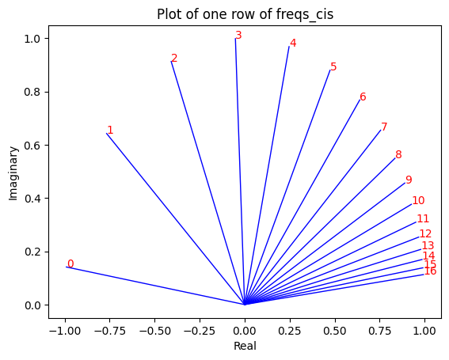
    


### 现在我们的每个 token 的 query 元素都有一个复数（角度变化向量）

我们可以将 query（将其拆分成对）转换为复数，然后进行点积以根据位置旋转查询
<br>
说实话，想想都挺开心 :)


```python
q_per_token_as_complex_numbers = torch.view_as_complex(q_per_token_split_into_pairs)
q_per_token_as_complex_numbers.shape
```


    torch.Size([17, 64])


```python
q_per_token_as_complex_numbers_rotated = q_per_token_as_complex_numbers * freqs_cis
q_per_token_as_complex_numbers_rotated.shape
```


    torch.Size([17, 64])


### 得到旋转向量后
我们可以通过再次将复数看作实数来返回成对的 query


```python
q_per_token_split_into_pairs_rotated = torch.view_as_real(q_per_token_as_complex_numbers_rotated)
q_per_token_split_into_pairs_rotated.shape
```


    torch.Size([17, 64, 2])


旋转对现在已合并，我们现在有了一个新的 query 向量（旋转 query 向量），其 shape 为 [17x128]，其中 17 是 token 的数量，128 是 query 向量的维度


```python
q_per_token_rotated = q_per_token_split_into_pairs_rotated.view(q_per_token.shape)
q_per_token_rotated.shape
```


    torch.Size([17, 128])


# keys（几乎与 query 一模一样）

<div>
    
</div>
我是个懒鬼，所以不打算详细讲 keys 的数学过程，你只需要记住以下几点：

<br>
&gt; keys 生成的 key 向量的维度也是 128
<br>
&gt;  keys 的权重只有 query 的 1/4，因为 keys 的权重在 4 个头之间共享，以减少计算量
<br>
&gt; keys 也像 query 一样被旋转以添加位置信息，其原因相同


```python
k_layer0 = model["layers.0.attention.wk.weight"]
k_layer0 = k_layer0.view(n_kv_heads, k_layer0.shape[0] // n_kv_heads, dim)
k_layer0.shape
```


    torch.Size([8, 128, 4096])


```python
k_layer0_head0 = k_layer0[0]
k_layer0_head0.shape
```


    torch.Size([128, 4096])


```python
k_per_token = torch.matmul(token_embeddings, k_layer0_head0.T)
k_per_token.shape
```


    torch.Size([17, 128])


```python
k_per_token_split_into_pairs = k_per_token.float().view(k_per_token.shape[0], -1, 2)
k_per_token_split_into_pairs.shape
```


    torch.Size([17, 64, 2])


```python
k_per_token_as_complex_numbers = torch.view_as_complex(k_per_token_split_into_pairs)
k_per_token_as_complex_numbers.shape
```


    torch.Size([17, 64])


```python
k_per_token_split_into_pairs_rotated = torch.view_as_real(k_per_token_as_complex_numbers * freqs_cis)
k_per_token_split_into_pairs_rotated.shape
```


    torch.Size([17, 64, 2])


```python
k_per_token_rotated = k_per_token_split_into_pairs_rotated.view(k_per_token.shape)
k_per_token_rotated.shape
```


    torch.Size([17, 128])


## 现在，我们已经有了每个 token 的旋转后的 query 和 key
<div>
    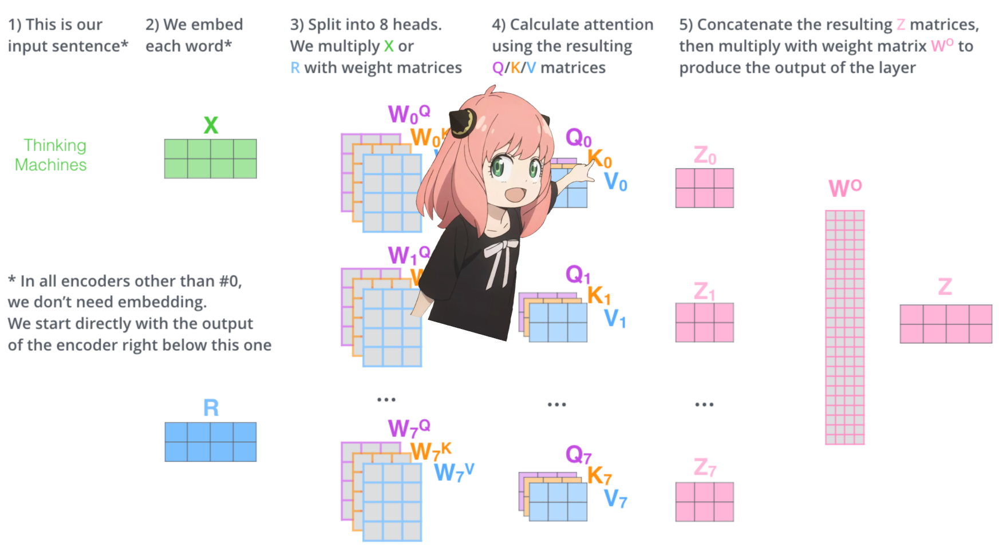
</div>
现在每个 query 和 key 的 shape 都是 [17x128]。

## 接下来，我们将 query 和 key 的矩阵相乘

这样做我们会得到每一个 token 相互映射的分数
<br>
这个分数描述了每个 token 的 query 与每个 token 的 key 的相关度。
这就是自注意力 :)
<br>
注意力得分矩阵（qk_per_token）的 shape 是 [17x17]，其中 17 是 prompt 中的 token 数量

<div>
    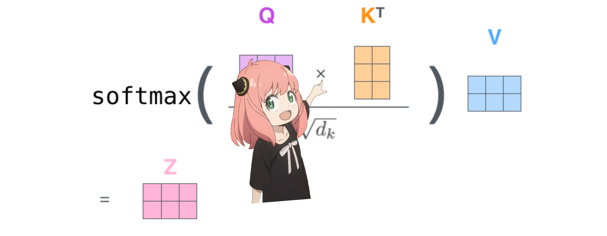
</div>


```python
qk_per_token = torch.matmul(q_per_token_rotated, k_per_token_rotated.T)/(head_dim)**0.5
qk_per_token.shape
```


    torch.Size([17, 17])


# 我们现在必须屏蔽 QK 分数

在 llama3 的训练过程中，未来的 token qk 分数被屏蔽。
<br>
为什么？因为在训练过程中，我们只学习使用过去的 token 来预测 token 。
<br>
因此，在推理过程中，我们将未来的 token 设置为零。
<div>
    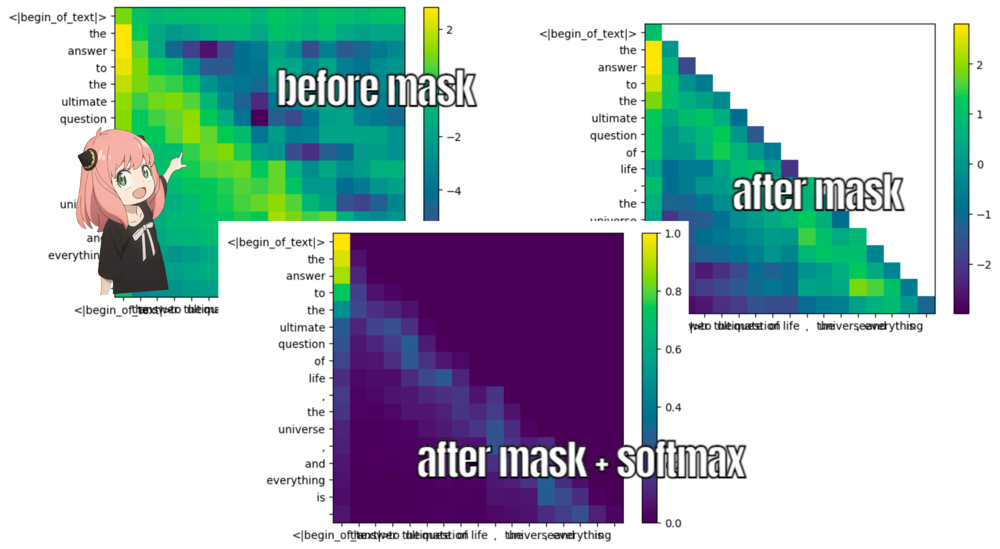
</div>


```python
def display_qk_heatmap(qk_per_token):
    _, ax = plt.subplots()
    im = ax.imshow(qk_per_token.to(float).detach(), cmap='viridis')
    ax.set_xticks(range(len(prompt_split_as_tokens)))
    ax.set_yticks(range(len(prompt_split_as_tokens)))
    ax.set_xticklabels(prompt_split_as_tokens)
    ax.set_yticklabels(prompt_split_as_tokens)
    ax.figure.colorbar(im, ax=ax)
    
display_qk_heatmap(qk_per_token)
```


    
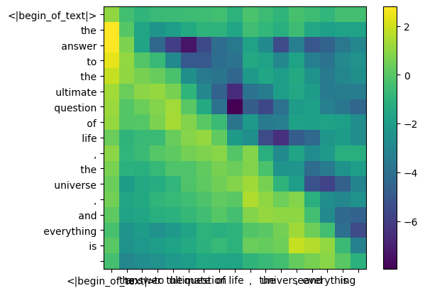
    


```python
mask = torch.full((len(tokens), len(tokens)), float("-inf"), device=tokens.device)
mask = torch.triu(mask, diagonal=1)
mask
```


    tensor([[0., -inf, -inf, -inf, -inf, -inf, -inf, -inf, -inf, -inf, -inf, -inf, -inf, -inf, -inf, -inf, -inf],
            [0., 0., -inf, -inf, -inf, -inf, -inf, -inf, -inf, -inf, -inf, -inf, -inf, -inf, -inf, -inf, -inf],
            [0., 0., 0., -inf, -inf, -inf, -inf, -inf, -inf, -inf, -inf, -inf, -inf, -inf, -inf, -inf, -inf],
            [0., 0., 0., 0., -inf, -inf, -inf, -inf, -inf, -inf, -inf, -inf, -inf, -inf, -inf, -inf, -inf],
            [0., 0., 0., 0., 0., -inf, -inf, -inf, -inf, -inf, -inf, -inf, -inf, -inf, -inf, -inf, -inf],
            [0., 0., 0., 0., 0., 0., -inf, -inf, -inf, -inf, -inf, -inf, -inf, -inf, -inf, -inf, -inf],
            [0., 0., 0., 0., 0., 0., 0., -inf, -inf, -inf, -inf, -inf, -inf, -inf, -inf, -inf, -inf],
            [0., 0., 0., 0., 0., 0., 0., 0., -inf, -inf, -inf, -inf, -inf, -inf, -inf, -inf, -inf],
            [0., 0., 0., 0., 0., 0., 0., 0., 0., -inf, -inf, -inf, -inf, -inf, -inf, -inf, -inf],
            [0., 0., 0., 0., 0., 0., 0., 0., 0., 0., -inf, -inf, -inf, -inf, -inf, -inf, -inf],
            [0., 0., 0., 0., 0., 0., 0., 0., 0., 0., 0., -inf, -inf, -inf, -inf, -inf, -inf],
            [0., 0., 0., 0., 0., 0., 0., 0., 0., 0., 0., 0., -inf, -inf, -inf, -inf, -inf],
            [0., 0., 0., 0., 0., 0., 0., 0., 0., 0., 0., 0., 0., -inf, -inf, -inf, -inf],
            [0., 0., 0., 0., 0., 0., 0., 0., 0., 0., 0., 0., 0., 0., -inf, -inf, -inf],
            [0., 0., 0., 0., 0., 0., 0., 0., 0., 0., 0., 0., 0., 0., 0., -inf, -inf],
            [0., 0., 0., 0., 0., 0., 0., 0., 0., 0., 0., 0., 0., 0., 0., 0., -inf],
            [0., 0., 0., 0., 0., 0., 0., 0., 0., 0., 0., 0., 0., 0., 0., 0., 0.]])


```python
qk_per_token_after_masking = qk_per_token + mask
display_qk_heatmap(qk_per_token_after_masking)
```


    
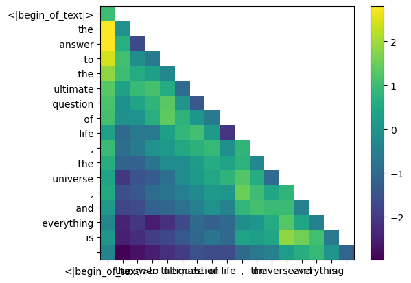
    


<div>
    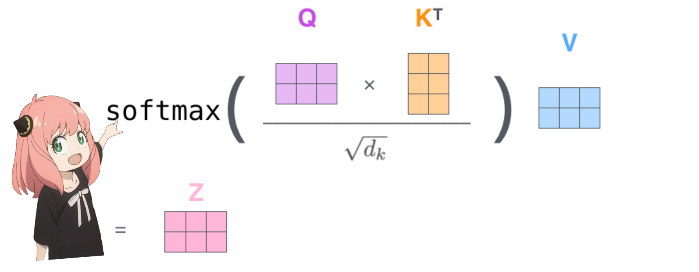
</div>


```python
qk_per_token_after_masking_after_softmax = torch.nn.functional.softmax(qk_per_token_after_masking, dim=1).to(torch.bfloat16)
display_qk_heatmap(qk_per_token_after_masking_after_softmax)
```


    
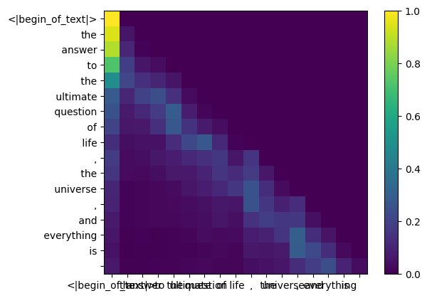
    


## values (注意力机制的最后部分) 


<div>
    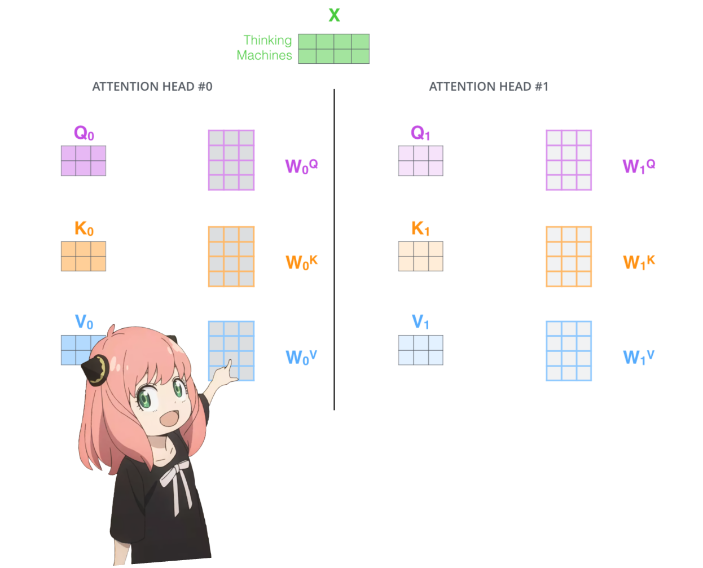
</div>
这些分数（0-1）用于确定每个 token 中使用了多少 value 矩阵
these scores (0-1) are used to determine how much of value matrix is used per token
<br>
&gt; 和 key 一样，value 权重也在每 4 个注意力头之间进行共享（以节省计算量）

<br>
&gt; 因此，下面的 value 权重矩阵的 shape 为 [8x128x4096]


```python
v_layer0 = model["layers.0.attention.wv.weight"]
v_layer0 = v_layer0.view(n_kv_heads, v_layer0.shape[0] // n_kv_heads, dim)
v_layer0.shape
```


    torch.Size([8, 128, 4096])


the first layer, first head value weight matrix is given below


```python
v_layer0_head0 = v_layer0[0]
v_layer0_head0.shape
```


    torch.Size([128, 4096])


## value 向量
<div>
    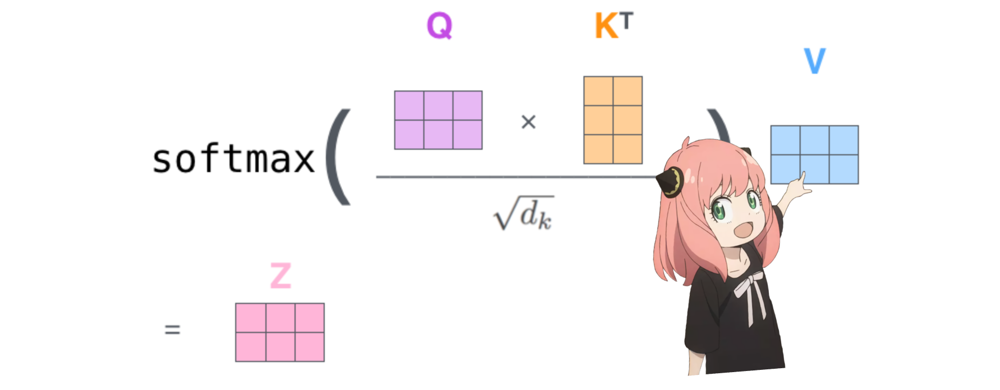
</div>
现在使用 value 权重来获取每个 token 的注意力值，其大小为 [17x128]，其中 17 是 prompt 中的 token 数，128 是每个 tokene 的 value 向量的维度


```python
v_per_token = torch.matmul(token_embeddings, v_layer0_head0.T)
v_per_token.shape
```


    torch.Size([17, 128])


## 注意力(attention)
<div>
    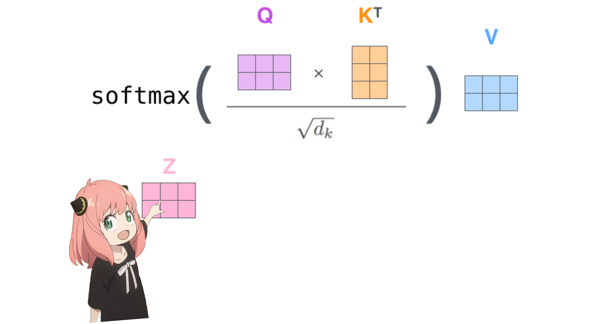
</div>
和每个 token 的 value 相乘后得到的注意力向量的 shape 为 [17*128]

```python
qkv_attention = torch.matmul(qk_per_token_after_masking_after_softmax, v_per_token)
qkv_attention.shape
```


    torch.Size([17, 128])


# 多头注意力 (multi head attention)
<div>
    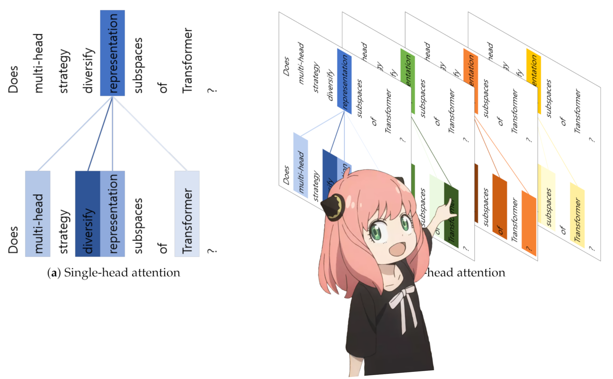
</div>
我们现在已经有了第一层和第一个头的注意力值
<br>
现在我将运行一个循环，并执行与上面单元格中相同的数学运算，但只针对第一层中的每个头


```python
qkv_attention_store = []

for head in range(n_heads):
    q_layer0_head = q_layer0[head]
    k_layer0_head = k_layer0[head//4] # key weights are shared across 4 heads
    v_layer0_head = v_layer0[head//4] # value weights are shared across 4 heads
    q_per_token = torch.matmul(token_embeddings, q_layer0_head.T)
    k_per_token = torch.matmul(token_embeddings, k_layer0_head.T)
    v_per_token = torch.matmul(token_embeddings, v_layer0_head.T)

    q_per_token_split_into_pairs = q_per_token.float().view(q_per_token.shape[0], -1, 2)
    q_per_token_as_complex_numbers = torch.view_as_complex(q_per_token_split_into_pairs)
    q_per_token_split_into_pairs_rotated = torch.view_as_real(q_per_token_as_complex_numbers * freqs_cis[:len(tokens)])
    q_per_token_rotated = q_per_token_split_into_pairs_rotated.view(q_per_token.shape)

    k_per_token_split_into_pairs = k_per_token.float().view(k_per_token.shape[0], -1, 2)
    k_per_token_as_complex_numbers = torch.view_as_complex(k_per_token_split_into_pairs)
    k_per_token_split_into_pairs_rotated = torch.view_as_real(k_per_token_as_complex_numbers * freqs_cis[:len(tokens)])
    k_per_token_rotated = k_per_token_split_into_pairs_rotated.view(k_per_token.shape)

    qk_per_token = torch.matmul(q_per_token_rotated, k_per_token_rotated.T)/(128)**0.5
    mask = torch.full((len(tokens), len(tokens)), float("-inf"), device=tokens.device)
    mask = torch.triu(mask, diagonal=1)
    qk_per_token_after_masking = qk_per_token + mask
    qk_per_token_after_masking_after_softmax = torch.nn.functional.softmax(qk_per_token_after_masking, dim=1).to(torch.bfloat16)
    qkv_attention = torch.matmul(qk_per_token_after_masking_after_softmax, v_per_token)
    qkv_attention = torch.matmul(qk_per_token_after_masking_after_softmax, v_per_token)
    qkv_attention_store.append(qkv_attention)

len(qkv_attention_store)
```


    32


<div>
    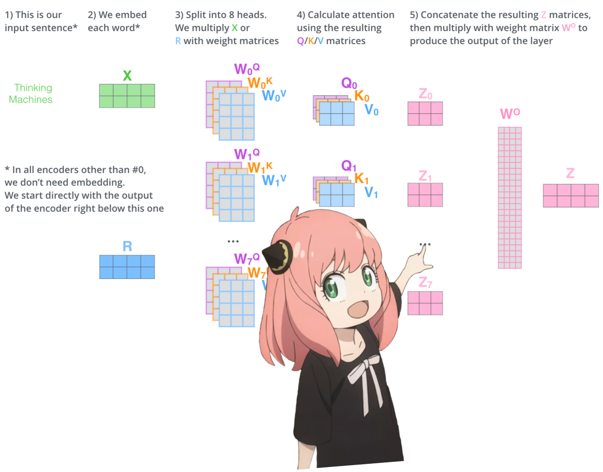
</div>
现在我们有了第一个层的 32 个头的 qkv_attention 矩阵，接下来我将把所有注意力分数合并成一个大矩阵，大小为 [17x4096]

<br>
在坚持一下，我们快要结束了 :)


```python
stacked_qkv_attention = torch.cat(qkv_attention_store, dim=-1)
stacked_qkv_attention.shape
```


    torch.Size([17, 4096])


# 权重矩阵，最后几步之一
<div>
    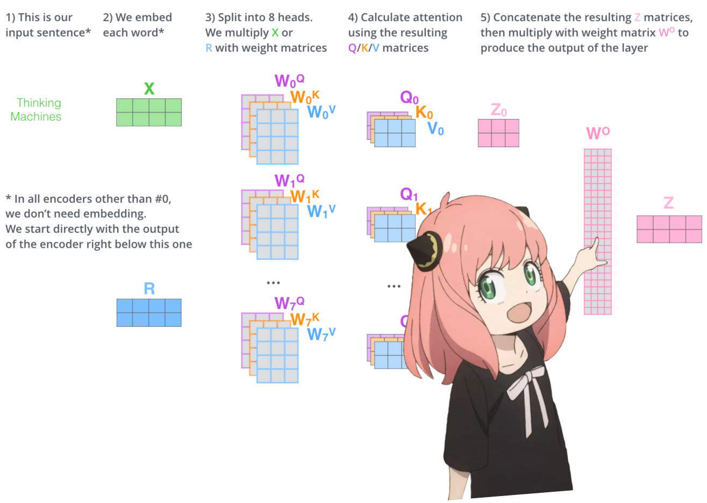
</div>
对于第0层，最后要做的一件事是，将权重矩阵相乘

```python
w_layer0 = model["layers.0.attention.wo.weight"]
w_layer0.shape
```


    torch.Size([4096, 4096])


### 这是一个简单的线性层，所以我们只需要进行乘法运算


```python
embedding_delta = torch.matmul(stacked_qkv_attention, w_layer0.T)
embedding_delta.shape
```


    torch.Size([17, 4096])


<div>
    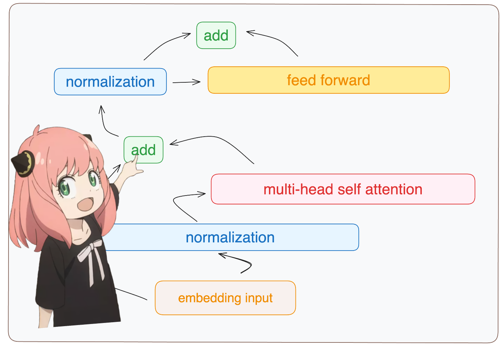
</div>
注意之后，我们现在有了嵌入值的变化，应该将其添加到原始的 token embeddings 中

```python
embedding_after_edit = token_embeddings_unnormalized + embedding_delta
embedding_after_edit.shape
```


    torch.Size([17, 4096])


## 我们将其归一化，然后运行一个前馈神经网络

<div>
    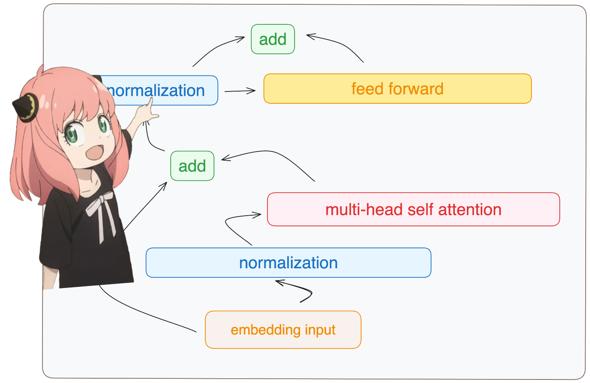
</div>


```python
embedding_after_edit_normalized = rms_norm(embedding_after_edit, model["layers.0.ffn_norm.weight"])
embedding_after_edit_normalized.shape
```


    torch.Size([17, 4096])


## 加载 ff 权重并实现前馈网络

<div>
    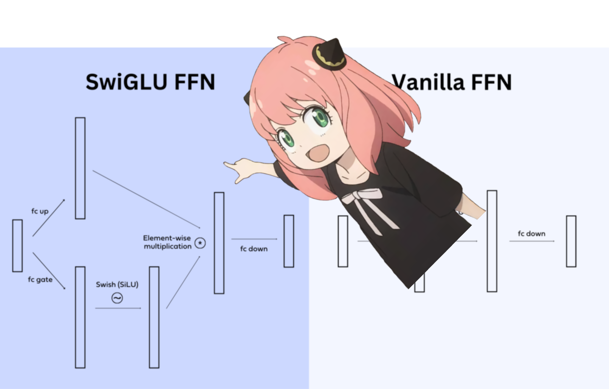
</div>
在 llama3 中，他们使用了 SwiGLU 前馈网络，这种网络架构非常擅长非线性计算。

<br>
如今，在 LLMS 中使用这种前馈网络架构是相当常见的


```python
w1 = model["layers.0.feed_forward.w1.weight"]
w2 = model["layers.0.feed_forward.w2.weight"]
w3 = model["layers.0.feed_forward.w3.weight"]
output_after_feedforward = torch.matmul(torch.functional.F.silu(torch.matmul(embedding_after_edit_normalized, w1.T)) * torch.matmul(embedding_after_edit_normalized, w3.T), w2.T)
output_after_feedforward.shape
```


    torch.Size([17, 4096])


# 在第一层之后，我们终于为每个 token 编辑了新的 EMBEDDINGS
离我们结束还剩 31 层（一层 for 循环）
<br>
您可以将经过编辑的 embedding 想象为包含有关第一层上提出的所有 query 的信息
<br>
现在，对所有提出的问题每一层都会对 query 进行越来越复杂的编码，直到我们得到一个 embedding，其中包含了我们需要的下一个 token 的所有信息。

```python
layer_0_embedding = embedding_after_edit+output_after_feedforward
layer_0_embedding.shape
```


    torch.Size([17, 4096])


# 天啊，所有事情都碰到一起了
<div>
    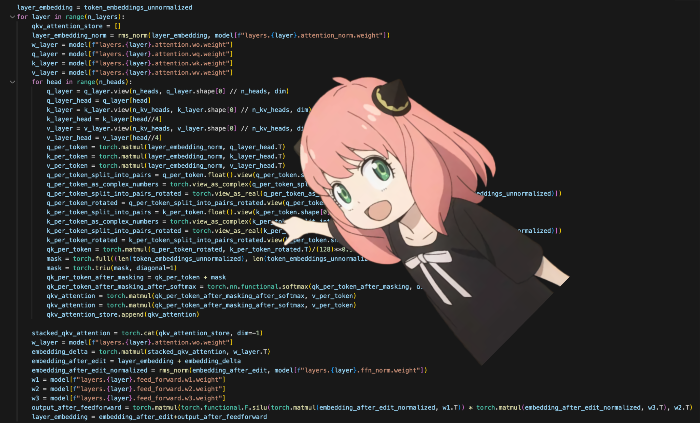
</div>
现在就是这样。 之前为每一层所做的一切都需要一次性完成。
<br>

# 都到这里了，希望你能看的开心 :)


```python
final_embedding = token_embeddings_unnormalized
for layer in range(n_layers):
    qkv_attention_store = []
    layer_embedding_norm = rms_norm(final_embedding, model[f"layers.{layer}.attention_norm.weight"])
    q_layer = model[f"layers.{layer}.attention.wq.weight"]
    q_layer = q_layer.view(n_heads, q_layer.shape[0] // n_heads, dim)
    k_layer = model[f"layers.{layer}.attention.wk.weight"]
    k_layer = k_layer.view(n_kv_heads, k_layer.shape[0] // n_kv_heads, dim)
    v_layer = model[f"layers.{layer}.attention.wv.weight"]
    v_layer = v_layer.view(n_kv_heads, v_layer.shape[0] // n_kv_heads, dim)
    w_layer = model[f"layers.{layer}.attention.wo.weight"]
    for head in range(n_heads):
        q_layer_head = q_layer[head]
        k_layer_head = k_layer[head//4]
        v_layer_head = v_layer[head//4]
        q_per_token = torch.matmul(layer_embedding_norm, q_layer_head.T)
        k_per_token = torch.matmul(layer_embedding_norm, k_layer_head.T)
        v_per_token = torch.matmul(layer_embedding_norm, v_layer_head.T)
        q_per_token_split_into_pairs = q_per_token.float().view(q_per_token.shape[0], -1, 2)
        q_per_token_as_complex_numbers = torch.view_as_complex(q_per_token_split_into_pairs)
        q_per_token_split_into_pairs_rotated = torch.view_as_real(q_per_token_as_complex_numbers * freqs_cis)
        q_per_token_rotated = q_per_token_split_into_pairs_rotated.view(q_per_token.shape)
        k_per_token_split_into_pairs = k_per_token.float().view(k_per_token.shape[0], -1, 2)
        k_per_token_as_complex_numbers = torch.view_as_complex(k_per_token_split_into_pairs)
        k_per_token_split_into_pairs_rotated = torch.view_as_real(k_per_token_as_complex_numbers * freqs_cis)
        k_per_token_rotated = k_per_token_split_into_pairs_rotated.view(k_per_token.shape)
        qk_per_token = torch.matmul(q_per_token_rotated, k_per_token_rotated.T)/(128)**0.5
        mask = torch.full((len(token_embeddings_unnormalized), len(token_embeddings_unnormalized)), float("-inf"))
        mask = torch.triu(mask, diagonal=1)
        qk_per_token_after_masking = qk_per_token + mask
        qk_per_token_after_masking_after_softmax = torch.nn.functional.softmax(qk_per_token_after_masking, dim=1).to(torch.bfloat16)
        qkv_attention = torch.matmul(qk_per_token_after_masking_after_softmax, v_per_token)
        qkv_attention_store.append(qkv_attention)

    stacked_qkv_attention = torch.cat(qkv_attention_store, dim=-1)
    w_layer = model[f"layers.{layer}.attention.wo.weight"]
    embedding_delta = torch.matmul(stacked_qkv_attention, w_layer.T)
    embedding_after_edit = final_embedding + embedding_delta
    embedding_after_edit_normalized = rms_norm(embedding_after_edit, model[f"layers.{layer}.ffn_norm.weight"])
    w1 = model[f"layers.{layer}.feed_forward.w1.weight"]
    w2 = model[f"layers.{layer}.feed_forward.w2.weight"]
    w3 = model[f"layers.{layer}.feed_forward.w3.weight"]
    output_after_feedforward = torch.matmul(torch.functional.F.silu(torch.matmul(embedding_after_edit_normalized, w1.T)) * torch.matmul(embedding_after_edit_normalized, w3.T), w2.T)
    final_embedding = embedding_after_edit+output_after_feedforward
```

# 我们现在有了最终的嵌入，模型可以对下一个 token 做出的最优猜测
the shape of the embedding is the same as regular token embeddings [17x4096] where 17 is the number of tokens and 4096 is the embedding dim
embedding 的 shape 与常规 token embedding [17x4096] 相同，其中 17 是 token 数量，4096 是 embedding 维度
<div>
    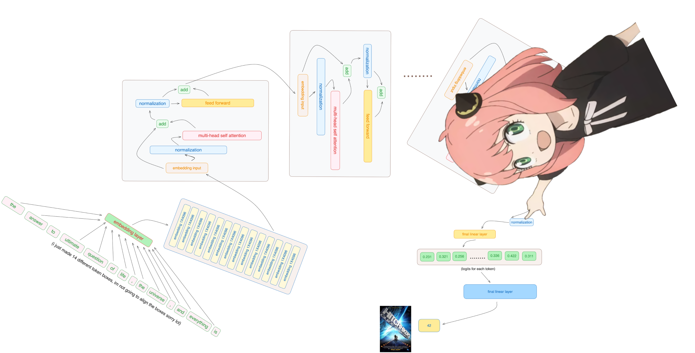
</div>


```python
final_embedding = rms_norm(final_embedding, model["norm.weight"])
final_embedding.shape
```


    torch.Size([17, 4096])


# 最后，我们将 embedding 解码为 token value 。

<div>
    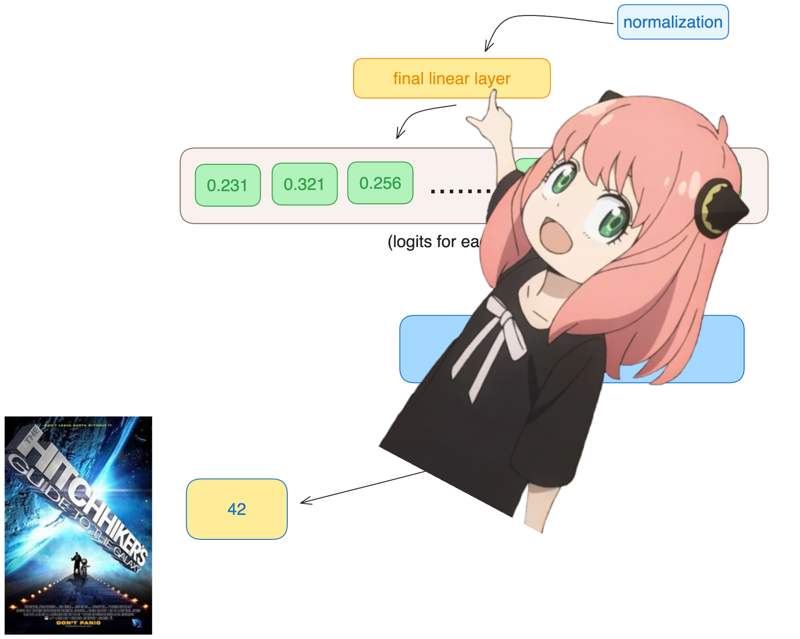
</div>
我们将使用输出解码器将最终 embedding 转换为 token。

```python
model["output.weight"].shape
```


    torch.Size([128256, 4096])


# 我们使用最后一个 token 的 embedding 来预测下一个值。
希望在我们预料之内, 42 :)
note: 42 is the answer to "the answer to the ultimate question of life, the universe, and everything is ", according to the book "hitchhiker's guide to the galaxy", most mordern llms would answer with 42 here, which should validate our entire code! wish me luck :)
注意：根据《银河系漫游指南》书中提到，“生命、宇宙和一切的终极问题的答案是 42 ” 。大多数现代语言模型在这里应该会回答 42，这应该能验证我们的整个代码！祝我好运 :)


```python
logits = torch.matmul(final_embedding[-1], model["output.weight"].T)
logits.shape
```


    torch.Size([128256])


### 模型预测的 token 编号是 2983，这是否代表 42 的 token 编号？
我在给你加油呐喊！这已经是代码的最后一部分了，希望你已经信心满满 :)


```python
next_token = torch.argmax(logits, dim=-1)
next_token
```


    tensor(2983)


# 让我们搞起来!
<div>
    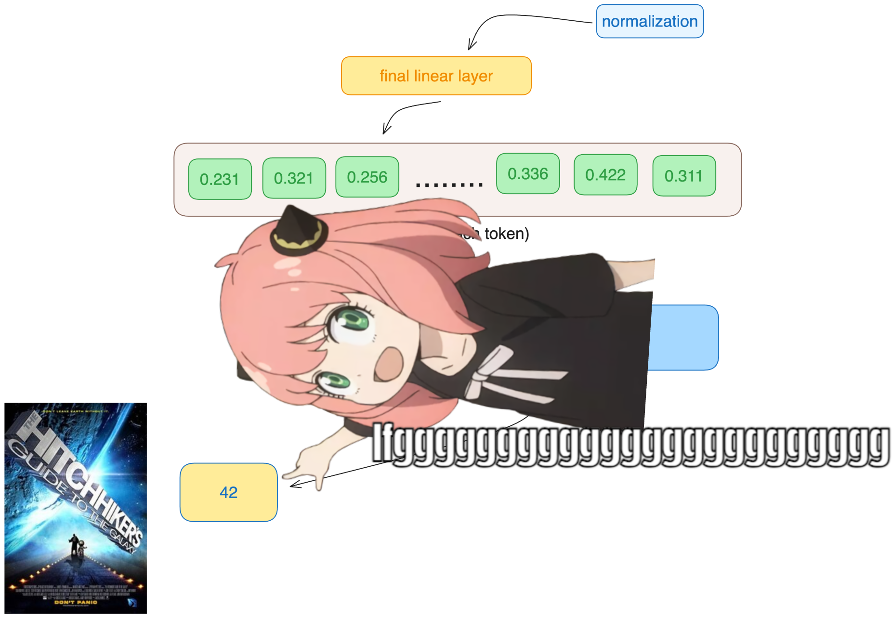
</div>


```python
tokenizer.decode([next_token.item()])
```


    '42'


# 感恩, 爱你哟 :)

这就是结尾了。希望你喜欢！

如果你想支持我的工作：

1. 在 Twitter 上关注我：https://twitter.com/naklecha
2. 或者给我买杯咖啡：[https://www.buymeacoffee.com/naklecha](https://www.buymeacoffee.com/naklecha)

说实话，如果你能到这一步，已经让我很开心了:)

## 我的动力是什么？


我和我的朋友们有一个价值观 - 让研究更加易于理解！

我们创建了一个名为 A10 的研究实验室 - [AAAAAAAAAA.org](http://aaaaaaaaaa.org/)

我们的论文：
<div>
    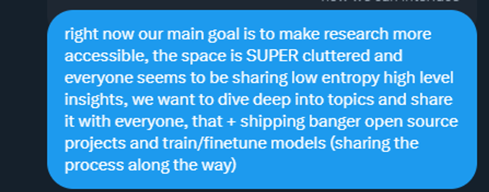
</div>
